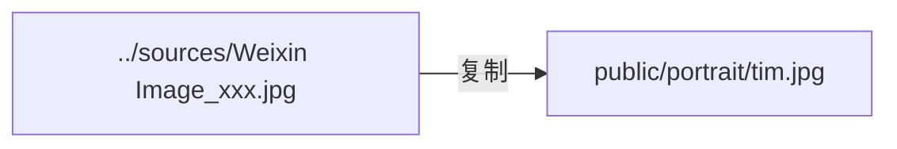

# setup-assets 脚本

**文件**: `scripts/setup-assets.mjs`

## 职责

构建前置脚本，在 `npm run dev` / `npm run build` 之前自动将源肖像照片复制到 `public/portrait/tim.jpg`。

## 流程



1. 从三个候选文件路径中依次检查是否存在
2. 存在则创建 `public/portrait/` 目录并复制
3. 若全不存在，打印警告（Hero 将回退为空白 Canvas）

## 候选路径

```javascript
const candidates = [
  'sources/Weixin Image_20260528134123_371_7.jpg',
  'sources/Weixin Image_20260528134356_378_7.jpg',
  'sources/Weixin Image_20260528134354_377_7.jpg',
]
```

## 触发方式

`package.json` 中配置为 `predev` 和 `prebuild` hook，保证每次启动时肖像为最新版本。

## 幂等性

- 若目标文件已存在且源文件未变，每次 `copyFileSync` 都是安全覆盖
- 无副作用（不会清理已有文件）
