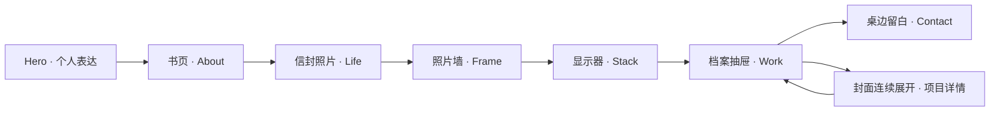

# 整站空间叙事与交互设计

> 当前实现更新：空间主线与项目详情已接入，最新[房间装修与整站准备](../delivery/warm-archive.md)也已完成。下文保留设计 v1 原始分镜，实际实现、差异与检查入口见[网页交付](../delivery/web-choreography.md)，不再将下文的「待开发」作为当前状态。

版本：设计 v1 · 2026-09-07 定稿。范围：桌面 Landing。全站体验与行为设计已完成，新增效果待开发；当前可运行范围见 [交付记录](../delivery/personal-space.md)。手机端与 Studio 继续暂缓。具体分镜区间、详情 URL 和失败行为见 [交互交接规格](interaction-contracts.md)。

## 体验主张

访客从 Tim 的个人表达出发，通过笔记、生活照片、摄影、工具和项目认识他，最后回到一个可以发起交流的空间。房间里的物件承担章节之间的联系，原站排版与长篇滚动继续承担表达和阅读。

整站的连续性来自同一个对象在不同尺度之间的变化：书页变成 About，照片变成摄影展示，屏幕里的结构变成 Stack，档案封面变成项目详情。每次转场都有可以持续追踪的对象、边缘或文字。

保留暗色基调、衬线与等宽字的对照、摄影留白、Frame 横向叙事、Stack 红线、Work Glass 与项目证据内容。参考 Unseen 的空间构图与稳定导航；具体已观察事实见 [参考记录](unseen-reference.md)，这里的镜头和时序是为本站设计的方案。

## 全站节奏

三个视觉高潮分别是进入书页、从摄影信号进入工程结构、项目封面展开。Life 与 Contact 保持舒缓。房间全景只在开场建立方位、结尾形成回应；中途采用相邻物件之间的局部移动。

正文期间镜头停稳或房间释放，滚动控制正文。下一段开始时再接管镜头。不要在同一滚动距离内同时要求用户阅读大段文字、跟随镜头转向和观看粒子聚合。

## 01 · Hero → About：从个人表达进入记录

保留姓名、粒子肖像、签名与现有入场。开场后半段可以让细窄窗光与纸边逐渐进入背景，提前给房间一点线索；这些线索不得影响姓名可读区域，也不增加强制 Enter 操作。

房间进入后，沿已实现的书页路线推进。封面打开后先看见真实 About 档案，再靠近、归正、占满视口，交给正常正文。书页和正文共用标题、头像、行宽与间距；末帧展示副本和正文只允许一个成为可见阅读面。

About 结束以结尾页收束，恢复纸面边界后回到书桌。该段已有实现与运行修复，本阶段保留为全站连续转场的基准，具体区间见 [书页设计](desktop-archive-entry.md)。新增 Hero 窗光线索尚未开发。

## 02 · About → Life：从记录进入生活

现有结尾页退回书本，镜头转向书架，信封打开、照片抽出并靠近，继续使用。下一步补齐照片与 Life 的实际交接：抽出的照片与 Life 第一张展示图使用同一资源和同一裁切依据。

照片接近时保持纸边，随后向一侧移动，成为生活照片群中的第一张。其他照片从它的前后景位置展开，接到现有 DriftWall。Life 的 “Off the clock…” 标题在照片获得稳定位置后出现；不再次播放一个独立的全屏入场。

Life 阅读阶段保留漂移、轻微景深关系与现有文案。鼠标靠近单张照片时，其他图只轻微降低存在感，选中图提高对比度；不让整个房间持续绕行。普通滚动可以完整阅读；照片点击统一接入照片查看路径，尚未连接的 Life 入口作为开发项处理。

## 03 · Life → Frame：生活切片成为摄影档案

先从 Life 尾部确定一张固定的真实摄影图片作为交接对象。该图片需要与 Frame 索引中的图像一致；由内容配置指定，不能因为轮播时机不同而随机换图。

1. Life 的漂移逐渐停稳。交接照片保持清晰，周围照片向视野边缘退出。
2. 照片出现纸张边缘和金属夹具，镜头略微退开，显露它所在的照片墙。这里仅揭示墙面局部。
3. 镜头沿摄影挂杆侧移，纸张的纵向排列逐渐接续为 Frame 索引的横向节奏。
4. 真实 Frame 开场文字与索引接管，继续进入 Building、Cuisine、Scenery 的既有横向章节。

Frame 主体仍使用现有弯曲图像、主题编组、HUD 和留白。房间只负责入口方位，不能同时拉动 Frame 的横向轨道。照片展示区域归正后再启用原有主题滚动。

初始转场预算为额外 90–120svh 的实际滚动距离；这是一项设计起点，需由 tim 调整节奏，不按固定秒数阻止滚动。

## 04 · Frame → Stack：从观看进入构建

复用已有 `FrameParticleHandoff`，把现有“摄影像素成为信号”的表达接到显示器。

末张风景保持主体轮廓，像素从图像边缘开始离散，向显示器所在方向汇聚。粒子未接管之前不撤走原图；粒子汇聚到屏幕中的同一图像后，露出屏幕边框、桌面与局部台灯。

镜头沿这个方向继续靠近屏幕。屏幕里的图像让出位置，真实 Stack 标题与红色结构线建立起来，屏幕边框移出视野，成为原来的 Stack 页面。标题不重复再演一次整体展开。

Stack 的技能行、项目引用、Working Set 和红线继续完整保留。红线承担阅读推进，房间不在正文背后持续运动。

这是原有粒子交接的重编排：为它加入屏幕落点和页面接续，不在其后追加第二段独立粒子秀。初始总交接预算 120–160svh，实施时优先复用原交接占用的滚动距离。

## 05 · Stack → Work：工具成为交付

Stack 末段的红线向右下方延伸，短暂显露显示器底座和桌沿，接到档案抽屉的标签位置。现有 Laser 作为这段线条运动的强调，完成后退出。

抽屉沿真实导轨拉开，档案夹错开少量深度，第一份档案被抬起。其封面使用当前 Work 开场实际选定的项目内容。封面逐渐放大并归正，接续 Work 开场；其余档案的位置关系可以成为后续项目编排的背景线索。

进入 Work 后保留原项目卡片、Glass、图片组合与 SciScope 独立影片段落。每个项目不是一个需要重新打开的抽屉，用户正常滚动即可浏览全部项目。

现有 WorkTransition 的前进输入限制必须在重编排中移除，改为纯进度驱动；不能为了等待抽屉打开而锁定滚轮。导航直达 Work 时直接显示阅读状态。

初始总交接预算 100–140svh，替换当前 Stack → Work 过渡职责，不重复插入两段过渡。正文开始前 Laser 交出控制权，详情阅读时保持停用。

## 06 · Work → 项目详情：封面就是下一页

这里优先实现 tim 指定的 Index 进入 Project 的连续感。用户点中的具体图片、当前裁切与项目标题，必须成为详情的入场起点。

### 打开

卡片先得到很轻的前移，周围内容降低对比度。选中图片保持可辨认，边框向详情首图的实际尺寸展开；项目标题沿同一运动接到详情标题位置。封面放大期间可以保留很少的边缘粒子，图像中心持续完整。

采用一次完整的“源卡片 → 目标首图”几何交接。现有 `ParticlePortal` 的源图选择、目标图解析、Glass 暂停和取消清理继续复用；更改 `case-expand` / `case-collapse` 的运动表现，不再叠加一个独立放大器。

详情首屏稳定后，下方证据内容顺着正常文档展开。维持 Base UI Dialog 的焦点约束、关闭方式和背景滚动隔离；宽度、首图与正文高度按完整 case study 阅读面处理。长文不贴进模型文件夹，也不保持透视。

### 关闭、切换与加载

关闭先停止详情的局部动效，再回到源项目卡片。若详情已滚动很远，使用缓存的首图展示副本承接关闭，不能让访客先看见页面突然滚回顶部。源卡片仍在视口内时回收至原图位置；源节点已不存在或布局改变时，恢复列表与焦点，采用短暂透明度交接。

初始打开时长 750–950ms、关闭 550–700ms；大幅运动前预取详情首图和模块。等待时保持被点击的卡片可见，显示简短加载状态；失败保留原项目与重试入口。连续点击只保留最后一次有效意图，Escape 可中断过渡，不会永久锁住页面。

详情属于列表的可退出阅读状态。URL 采用 Landing 内的 `?project=<project-id>#projects`，打开、直接访问、关闭及浏览器历史行为已在 [交互规格](interaction-contracts.md) 中确定，待开发；当前 Dialog 尚不具备这一深链能力。

## 07 · Work → Contact：回到一个可以交流的地方

最后一个项目结束后，档案页边缘收束，镜头从桌沿稍微拉开：书仍然打开，一张照片留在手边，抽屉保持微开。画面右下方是家具，左上方和中央留给联系方式。

已有 Contact Iris 用来揭示这块留白，收束到台灯暖光周围，避免把整屏长时间盖成黑色。房间停稳后退出高频渲染，现有 “LET'S BUILD”、邮箱与社交链接接续出现。液体光标效果只在这些内容的背景低强度响应；ASCII、液体与空间不同时争夺高对比度中心。

邮箱依然直接可点击，不要求先点击某个物件。返回顶部只执行已有导航动作，不让访客重新观看全程倒放。初始额外过渡预算 70–100svh。

结尾的物件姿态由章节目标状态直接决定。首期不做访问记忆持久化；直接进入 Contact 也能形成完整构图。

## 全局交互规则

| 场景 | 设计行为 |
| --- | --- |
| 章节导航 | 固定界面保持稳定；点击直达真实阅读锚点，不穿越全部中间镜头 |
| 滚动与倒滚 | 镜头和模型姿态由当前进度计算；大幅跳转也能直接建立正确状态 |
| 目录展开 | 复用现有导航体系；大号章节名配小序号，最多占约四成视口，保留空间方位 |
| 指针 | 图像用现有查看提示、项目用打开提示；链接保留原生语义，不增加通屏追随标签 |
| 文字阅读 | 正文内容清楚、可选择；3D 展示副本不抢键盘焦点、不重复进入无障碍树 |
| 正文与效果交接 | 下一面完成资源准备并实际绘制后，上一面才退出；初始等待时仍有内容和直达入口 |
| 空间失败 | 继续使用原章节；不能留下一个没有文字、无法操作的黑色滚动段 |
| 关闭项目 | 恢复原项目位置和触发焦点，解除背景滚动隔离，销毁展示副本 |
| 声音 | 首期不新增声音依赖；未来若设计，默认关闭、显式开启 |

## 动效与美术约束

交接只有一个主要运动方向。Life → Frame 以水平移动为主；Frame → Stack 以信号汇聚和靠近为主；Stack → Work 以线条下行与抽屉前移为主；Contact 以轻微后退和停稳收束。接近正文时，旋转先收敛，再完成归正，不在大字可读时继续强烈扭转。

新微交互采用 160–240ms 的反馈、280–420ms 的归位作为初始值。滚动型转场不使用点击型定时动画来追赶滚动，也不增加多层缓动延迟。

窗侧冷光维持方向一致，台灯暖光只影响桌面附近。远景靠轮廓与明暗层次，近景再显露纸边、夹具、布纹和金属粗糙度。纸张、屏幕和网页之间的配色变化必须连续；摄影作品不因全站统一色调而被任意重染。

## 技术编排与黑屏预防

后续把 `ArchiveRoom` 的特定书页轨道拆为声明明确的章节镜头轨道，继续共用房间资产和现有 WebGL 配额。配置至少包含源/目标内容标识、相机姿态、物件动画区间、阅读交接点和失败行为。共享的是渲染生命周期，不是让一个巨型组件拥有全部章节的滚动状态。

每个交接使用 `prepare → visible → transfer → reading → released` 的生命周期；`visible` 代表已提交有效绘制，不是 Canvas 已创建。慢加载时保留上一阅读面；预算不足时先保留 DOM/静态展示，再释放旧 GPU 面给下一面使用。维持全站 context 上限，不将每章各建一张常驻 Canvas。

Frame 的 pin/横向轨道、Stack 的路径测量、Work 的详情焦点由原模块持有。空间交接通过现有章节状态与滚动刷新机制衔接，不直接改写其他章节内部的 scrollTop 或复制 Lenis。

视口变化时重新测量源图和目标矩形；如果几何暂不可用，维持可读页面并跳过本次变形。图片必须完成 decode，字体布局稳定后才固定过渡测量值。以源图标识和资源地址对应，避免用 DOM 顺序猜测是同一张图。

## 实施顺序与完成证据

| 顺序 | 独立交付范围 | 技术完成条件 |
| --- | --- | --- |
| 1 | Life 图像接续 → Frame 索引 | 同图映射、正倒滚、Frame 横向轨道接管、慢加载保留内容 |
| 2 | Frame 信号 → 显示器 → Stack | 复用单一粒子交接、标题不重复、红线平稳接棒 |
| 3 | Stack 红线 → 抽屉 → Work | 抽屉动画与封面连续、移除前进锁、导航直达 |
| 4 | 项目打开与关闭 | 同图放大、长文关闭、Escape 中断、焦点与滚动恢复 |
| 5 | Work → Contact + Hero 光线回应 | 联系入口持续可用、按需渲染、首尾构图一致 |
| 6 | 全站节奏统一 | 各接缝资源等待、直接跳转、快速倒滚和窗口变化不黑屏 |

本轮只完成整站设计与建模任务划分，不修改正式交互实现或 Blender 文件。后续每段实现均由 tim 验收视觉与节奏；运行检查、构建和资源契约是技术证据，不代替视觉验收。
