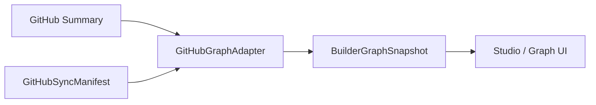

# 09 · Phase A Graph Adapter

> A3 定义 GitHub 安全投影到 Builder Graph read model 的 adapter。它不登录 GitHub，不保存 token，不请求真实 API。

## A3 结论

Builder Graph OS 的 GitHub 数据流分成两层：

- **source service**：未来在服务端读取 GitHub REST/GraphQL，负责鉴权、分页、限流和敏感字段清洗。
- **graph adapter**：只接收清洗后的 Summary，确定性生成 `BuilderGraphSnapshot`。

当前 A3 只实现第二层，并提供 Tim 公开作品的 demo graph。

## 为什么先做 adapter

产品主线需要先证明“项目经历可以变成可读的成长图谱”，而不是先陷入 OAuth、数据库、队列和 webhook。

因此这一阶段的正确顺序是：

1. 定义安全 Summary。
2. 用 Summary 生成 Builder Graph。
3. 用 demo graph 打磨 Studio / Graph UI。
4. 等 UI 和叙事闭环稳定，再接真实 GitHub service。

## 安全投影

`packages/content/src/githubGraphAdapter.ts` 当前定义：

- `GitHubProfileSummary`
- `GitHubRepositorySummary`
- `GitHubContributionSummary`
- `GitHubGraphAdapterInput`
- `GitHubGraphAdapter`

这些类型只允许进入：

- profile 展示信息
- repo metadata
- contribution metadata
- sourceUrl
- additions / deletions / changedFiles 等统计字段

不允许进入：

- access token
- refresh token
- installation token
- raw webhook payload
- raw diff / patch
- 私有源码内容

## Demo Graph

当前 demo graph 来自已有 `portfolioProjects`：

- `createTimPublicDemoBuilderGraph()`
- `timPublicDemoBuilderGraph`
- `timPublicDemoBuilderGraphRepository`

这样做的原因：

- demo 内容和 landing / work 的真实作品保持一致。
- Studio 可以先读取 graph read model 做 UI。
- 不会伪造一套和站内内容脱节的 mock 世界。

## 与 A1 / A2 的关系

- A1 定义 graph read model。
- A2 定义 GitHub 授权和 sync manifest 边界。
- A3 定义 GitHub Summary 到 graph read model 的转换层。

三者合起来形成当前 Phase A 的最小闭环：

## 当前守卫

`apps/landing/tests/build/content-layer-guards.mjs` 已经检查：

- A1 Builder Graph contract 存在。
- A2 GitHub Connector contract 存在。
- A3 GitHub Graph Adapter contract 存在。
- content adapter 不允许默认宽 OAuth repo scope。
- graph adapter 不允许暴露 token/raw payload 字段。

## 下一步

A4 可以开始做第一个 Builder Graph UI surface：

- Studio 中新增 `/graph` 或 `/lab/graph`。
- 先读取 `timPublicDemoBuilderGraphRepository`。
- 展示项目、仓库、能力信号和成长事件。
- 保持 “demo / not connected” 状态说明。

仍然不需要马上接真实 OAuth。
