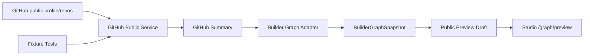

# 14 · Phase A Fixture Tests

> A8 为 GitHub public preview service 补离线 fixture 测试，避免长期验证依赖真实 GitHub 网络。

## A8 结论

Public preview 已经开始请求真实 GitHub API。为了让这条路径可维护，必须把核心状态变成离线可测：

- 正常 public user / repos / README。
- 用户不存在。
- GitHub rate limit。
- 空公开仓库列表。

这些测试不请求 GitHub，不需要 token，不读取 private repo。

## 当前实现

- `packages/content/tests/githubPublicService.test.ts`
- `packages/content/tests/fixtures/github-public-user.json`
- `packages/content/tests/fixtures/github-public-repos.json`
- `packages/content/tests/fixtures/github-public-readme.md`
- `packages/content/tests/fixtures/github-empty-repos.json`
- `packages/content/tests/ts-extension-loader.mjs`
- `packages/content/tests/register-ts-loader.mjs`

## Package 边界

`@timcai/content` 的主出口必须保持 landing-light，只暴露 landing/studio 共同需要的轻内容模型：

- `ContentMeta` / `PublishState` / repository interface。
- `createStaticRepository` / `createKeyedStaticRepository`。
- `portfolioProjects`。

Builder Graph、GitHub connector、public preview、public GitHub service 走显式子路径：

- `@timcai/content/builder-graph`
- `@timcai/content/github-connector`
- `@timcai/content/github-graph-adapter`
- `@timcai/content/public-preview`
- `@timcai/content/github-public-service`

这条边界用于防止 landing 主 bundle 因为 `@timcai/content` barrel export 被动打入 Studio-only 图谱代码。

## 测试入口

根目录新增：

```bash
npm run test:content
```

并接入：

- `npm run test:unit`
- `npm run test:build`

## 覆盖内容

Fixture tests 当前验证：

1. public preview 不发送 Authorization header。
2. public GitHub fixtures 可以生成 `BuilderGraphSnapshot`。
3. README 摘要进入 project draft，且代码块不会进入 excerpt。
4. fork / archived repo 正确分组。
5. `not_found` 不继续请求 repositories。
6. `rate_limited` 不暴露 GitHub 原始 response body。
7. 空 repo 返回 `repo_selection` draft，而不是崩溃。

## Phase A 当前收口

A1–A8 已形成完整最小闭环：



## 下一阶段

Phase B 可以开始做产品化强化，而不是继续补 Phase A 基建：

- 保存用户 draft。
- 用户编辑项目叙事。
- 公开 profile `/u/:handle`。
- 再进入 GitHub App / OAuth 授权。

Phase A 到此可以视为完成。
